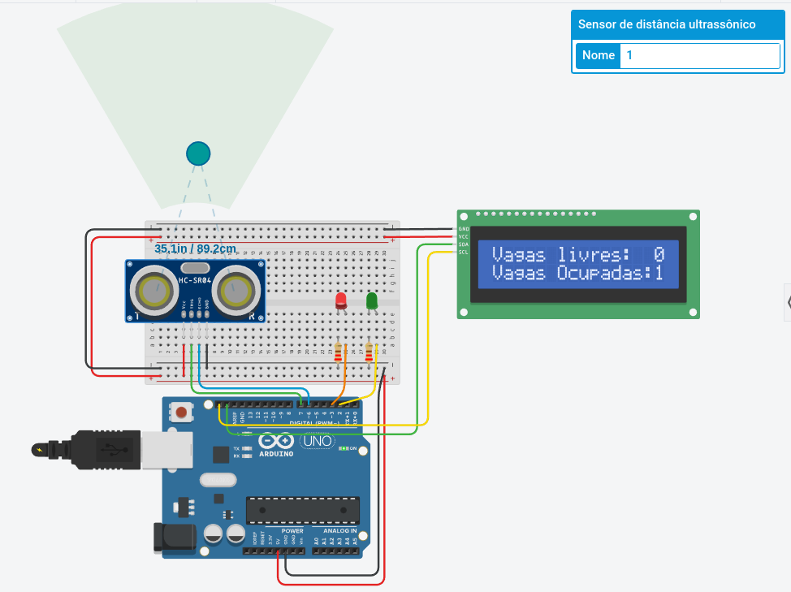

# gs-iot
Entregável da disciplina de IOT para a prova semestral (Global Solution).

**nome dos alunos:** 
* Carlos Alberto Mascarenhas Ferreira - RM 87204 
* Carlos Rithyellen de Souza Leal - RM 89052
* Rafael Felipe Zamignani - RM 87469
* Renan da Silva Ramos – RM 89339

**Turma:** 2TDSA

**Ano:** 2º ano, 2022

## Objetivo / descrição do Projeto

Um dos grandes problemas do trânsito é encontrar uma vaga para estacionar. Buscando auxiliar os clientes de um estacionamento, a empresa precisa desenvolver uma aplicação que faça a detecção de quantas vagas estão disponíveis.

## Diagrama do projeto

## Link de vídeo demonstração

Vídeo de demonstração do projeto funcionando.

[Link para o video youtube](https://youtu.be/mveXqowYkQY)
